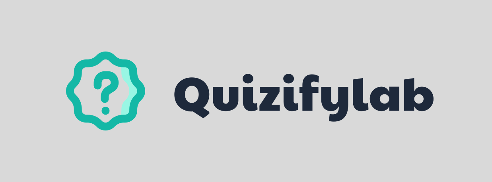

<div align="center"></div>

# Dynamic Quiz


[](https://deepsource.io/gh/zahid47/dynamic-quiz/?ref=repository-badge)

## Getting Started

### Prerequisites

- [Node.js](https://nodejs.org/en)

### Environment Variables

see `.env.test` file for all the env variables you need to set.

### Run Locally

Clone the project

```bash
  git clone https://github.com/zahid47/dynamic-quiz.git
```

Install dependencies

```bash
  yarn

  cd client

  yarn

  cd ../
```

Start server and client

```bash
  yarn all
```

Run Tests

```bash
  yarn test
```

### API Docs (WIP)

- available at "/docs"
